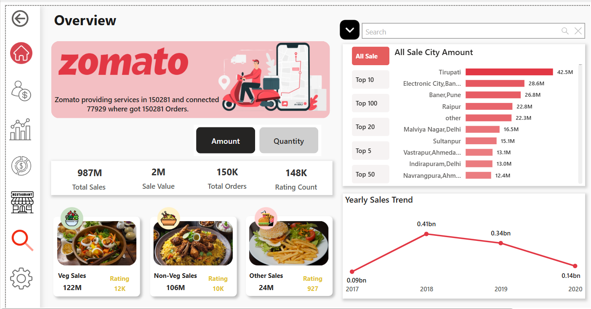
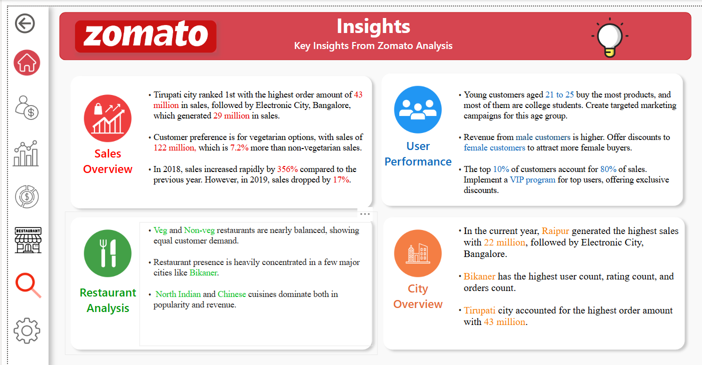

### Zomato Sales & User Performance Analysis 

Designed a **Zomato-themed Power BI dashboard** to analyze sales performance, user behavior, and restaurant insights. The dashboard transforms raw data into interactive visual reports, helping stakeholders monitor business performance, identify trends, and support data-driven decision-making.

---

## 🖼️ Dashboard Previews

### 1. Home Page


### 2. Overview  


### 3. User Performance  


### 4. City Analysis 


### 5. Restaurant Analysis  


### 6. Insights  
 
---

## 📌 Project Overview

This project analyzes Zomato's restaurant dataset to uncover insights into sales performance, customer behavior, restaurant performance, cuisine trends, and city-wise business growth.

The dashboard helps answer business questions such as:

Which city has the highest order volume?
Which restaurants are the top performers?
What is the average order value per city or user?
Who are the most active customers?

---

## 🎯 Business Problem Statement

Zomato operates across multiple cities and restaurants, generating large amounts of business data every day. Without an interactive reporting system, it becomes difficult to monitor business performance and identify growth opportunities.

This dashboard focuses on solving the following business problems:

### Revenue & Pricing Analysis
Analyze sales performance across different cities and identify revenue trends.

### Restaurant Performance Evaluation
Compare restaurants based on sales, ratings, and customer engagement to identify top-performing restaurants.

### Customer Preference Analysis
Understand customer preferences across cuisines, food categories, and demographic segments.

### Geographic Performance Comparison
Evaluate city-wise sales, users, and ratings to compare regional performance.

### Decision Support
Provide interactive reports that help stakeholders monitor KPIs and make data-driven decisions.

---

## 🎯 Core Objective

The goal of this project is to help Zomato make data-driven business decisions by converting large volumes of restaurant data into actionable insights. Using Power BI, Power Query, and DAX, the project analyzes restaurant performance, customer ratings, cuisines, pricing, and service availability to identify trends, evaluate business performance, and support strategic decision-making through an interactive dashboard.

---

## 📌 Executive Summary

This project is an end-to-end data analytics solution developed using the **Zomato Restaurant Dataset**. The dashboard was designed in **Power BI** to transform raw restaurant data into meaningful business insights through interactive visualizations.

The project focuses on:

* Understanding restaurant distribution across cities.
* Analyzing customer ratings and engagement.
* Evaluating pricing patterns and affordability.
* Identifying the most popular cuisines.
* Assessing online delivery and table booking services.
* Delivering an interactive dashboard to support strategic business decisions.

---

## Dataset

The dataset includes approximately 10,000+ rows and contains the following columns:

Order ID
User ID
City
Restaurant Name
Cuisine
Order Date
Item Count
Total Amount
Delivery Time
Rating

---

## Tools & Technologies

* **Power BI**
* **Power Query**
* **DAX (Data Analysis Expressions)**
* **Microsoft Excel (for data pre-cleaning)**
* **Custom Visuals**

  ---

## Data Cleaning & Preparation

The dataset was cleaned, transformed, and prepared for analysis using **Power Query** and **DAX** to ensure accurate reporting and meaningful insights.

### Data Cleaning
* Removed duplicate records to maintain data integrity.
* Handled missing and null values.
* Corrected inconsistent data formats and standardized values.
* Renamed columns for better readability and consistency.
* Verified data types for all fields.

### Data Transformation
* Created calculated columns to enhance data analysis.
* Developed DAX measures for KPIs and business metrics.
* Built relationships between tables to create an optimized data model.
* Optimized the dataset for interactive reporting and dashboard performance.

### Outcome
The cleaned and transformed dataset enabled accurate KPI calculations, dynamic filtering, and interactive visualizations across the dashboard, providing reliable business insights into sales, users, cities, and restaurant performance.
  ---
  
  ## Dashboard Features

The dashboard is organized into **6 interactive report pages**, each designed to provide actionable insights into Zomato's business performance.

### 1.Home Page

- Interactive landing page
- Navigation buttons
- Dashboard branding

 [View Home Page Dashboard](Screenshots/Home%20Page.png)

### 2. Overview
Provides a high-level summary of overall business performance.

**Key Metrics**
* Total Sales
* Total Users
* Total Orders
* Total Rating Count

**Visualizations**
* City-wise Sales Analysis
* Yearly Sales Trend
* Food Category Sales
* Quantity vs Amount Toggle
* Dynamic Top N City Analysis
 
 [View Overview Dashboard](Screenshots/Overview.png)

### 3. User Performance
Analyzes customer demographics and purchasing behavior.

**Key Metrics**
* Total Users
* Gained Customers
* Lost Customers
* Current Year Sales
* Previous Year Sales

**Visualizations**
* User Distribution by Age
* Sales by Marital Status
* Sales by Occupation
* Customer Gain vs Loss Analysis
* Gender-Based Sales Analysis

 [View User Performance Dashboard](Screenshots/User%20Performance.png)

### 4. City Performance
Provides detailed city-level business insights.

**Key Metrics**
* Total Cities
* Total Users
* Current Year Sales
* Previous Year Sales

**Visualizations**
* City-wise Sales Value
* City-wise User Count
* City-wise Rating Count
* Detailed City Performance Table

 [View City Performance Dashboard](Screenshots/City%20Performance.png)

### 5. Restaurant Analysis
Evaluates restaurant performance across different categories.

**Key Metrics**
* Restaurant Count
* Current Year Sales
* Previous Year Sales
* Average Rating

**Visualizations**
* Restaurant Count by City
* Restaurant Distribution by Food Type
* Top Cuisine Categories
* Restaurant Rating Comparison
* Cuisine-wise Revenue Analysis

 [View Restaurant Analysis Dashboard](Screenshots/Restaurant%20Analysis.png)

### 6. Insights
Summarizes key business findings and recommendations.

**Insights Include**
* Sales Performance Highlights
* User Behavior Analysis
* City-wise Business Performance
* Restaurant Performance Summary
* Business Recommendations based on dashboard analysis

 [View Insights Dashboard](Screenshots/Insights.png)
  
## Interactive Features

 Interactive Navigation Menu
* Dynamic Search
* Dropdown Slicers
* Gender Toggle
* Quantity vs Amount Toggle
* Top N Analysis (Top 5, Top 10, Top 20, Top 50 & Top 100)
* Cross-filtering Between Visuals
* KPI Cards
* Bookmarks
* Navigation Buttons

---

## DAX Measures Used

I created the following DAX measures to calculate key metrics used throughout the dashboard:

```DAX
Total Sales = SUM(orders[Value])

Total Orders = COUNTROWS(orders)

Total Users = DISTINCTCOUNT(orders[user_id])

Average Order Value =
DIVIDE([Total Sales], [Total Orders])

Average Rating =
AVERAGE(restaurant[rating])
```

  ---

  ## Filters & Slicers

The dashboard includes interactive filters to help users explore the data from different perspectives:

* Date Slicer
* City Slicer
* Restaurant Slicer
* Cuisine Slicer
* Dynamic Cross-filtering


  ---

  ## Key Insights

* The top three cities generate more than **60% of all orders**, making them the strongest contributors to overall business performance.

* **Tier 1 cities** consistently record the fastest delivery times, indicating a more efficient delivery network in these locations.

* A relatively small group of restaurants contributes a significant share of total revenue, highlighting the importance of high-performing restaurant partners.

* Some customers place orders more frequently and spend more per order than others. These users are ideal candidates for loyalty programs and personalized offers.

* In several cities, **higher customer ratings are associated with shorter delivery times**, suggesting that delivery speed has a positive impact on customer satisfaction.

  ---

  ## What I Learned

This project helped me improve my skills in:

* Data Cleaning using Power Query
* Data Modeling
* DAX Calculations
* KPI Development
* Dashboard Design
* Interactive Navigation using Bookmarks
* Business Analysis
* Data Visualization
* Building user-friendly Power BI reports

  ---

  ## Project Structure

```text
PowerBI_Zomato_Dashboard/
│
├──  Zomato_Dashboard.pbix          # Main Power BI dashboard
├── 📄README.md                     # Project documentation
├── 📁 Screenshots/                  # Dashboard screenshots
│   ├── index_page.png
│   ├── overview.png
│   ├── user_performance.png
│   ├── city_performance.png
│   ├── restaurant_analysis.png
│   └── insights.png
│
└── 📄 Zomato_Dataset.xlsx           # Dataset used for analysis
```

---

## ⭐ If you found this project helpful, consider giving it a star!
